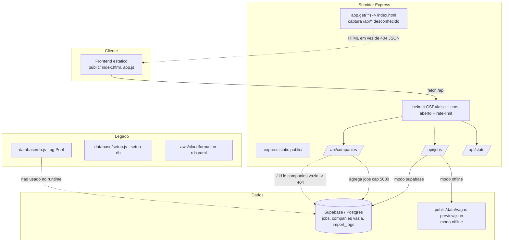
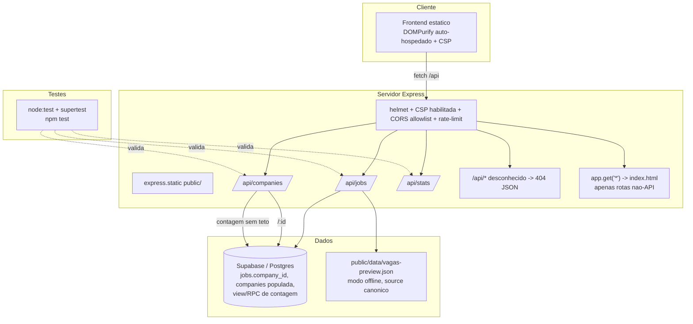
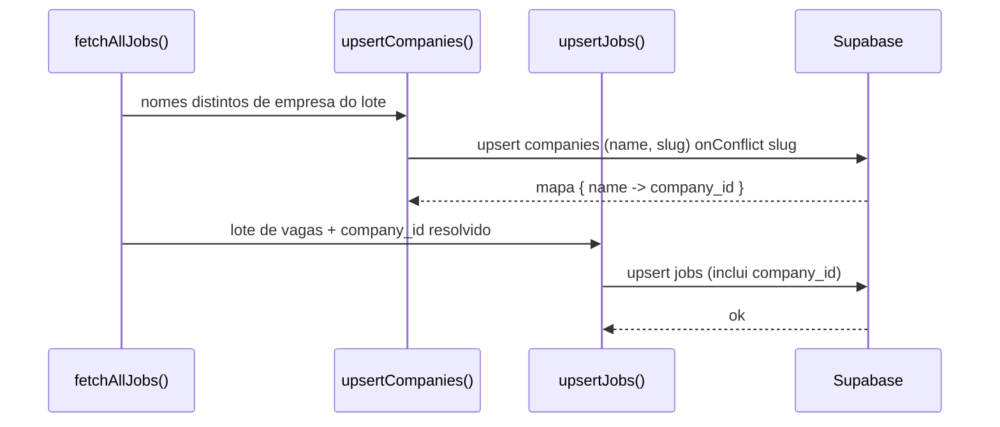

# Documento de Design: Recrutador Hardening

## Visão Geral

O `Recrutador` (marca interna "Q1Jobs") é um agregador de vagas em Node.js/Express que importa anúncios de APIs públicas (RemoteOK, Arbeitnow, The Muse, Adzuna, Jooble, Reed, entre outras) e os disponibiliza via API REST + frontend estático. O armazenamento migrou de PostgreSQL (AWS RDS) para Supabase, mas restaram artefatos legados de AWS/Postgres, além de inconsistências de dados e lacunas de segurança acumuladas durante a evolução do projeto.

Este design consolida cinco frentes de endurecimento ("hardening") que deixam o sistema coerente com a arquitetura Supabase atual, mais seguro e testável: (1) limpeza do legado AWS RDS/PostgreSQL; (2) correção da camada de empresas (`companies`); (3) endurecimento de segurança (CORS, rota 404 da API, DOMPurify/CSP); (4) correções de consistência (moeda padrão de salário e chave canônica de fonte); e (5) introdução de testes automatizados.

O objetivo é entregar um plano pronto para implementação, sem alterar comportamento funcional visível ao usuário além do necessário para corrigir defeitos. Nenhum código é escrito nesta fase — o documento descreve contratos, modelos de dados, diagramas e estratégia de testes. As decisões abertas que dependem do usuário estão destacadas logo abaixo e detalhadas nas seções de componentes.

## Baseline Já Concluído (Fora de Escopo)

As correções abaixo já foram aplicadas ao repositório e são consideradas linha de base. **Não devem ser re-discutidas nem re-implementadas** nesta spec; estão listadas apenas para contexto e para evitar regressões nos testes.

| Item | Estado atual | Evidência no código |
|------|--------------|---------------------|
| Sanitização de injeção em filtro PostgREST | DONE | `jobs.js` → `safeQ = String(q).replace(/[,()*\\"]/g, ' ').trim()` antes de montar o `.or(...)` |
| Guardas de paginação contra `NaN` | DONE | `jobs.js` e `companies.js` → `Math.max(1, parseInt(page) || 1)` e `Math.min(100, Math.max(1, parseInt(limit) || 20))` |
| Cliente Supabase do servidor usa apenas `ANON_KEY` (leitura) | DONE | `database/supabase.js` lê `SUPABASE_ANON_KEY`; a `SERVICE_KEY` só é usada nos scripts de importação server-side (`fetchJobs.js`, `fetchMax.js`, `fetchRemote.js`) |
| Placeholders no `.env.example` (sem segredos reais) | DONE | `.env.example` contém apenas valores de exemplo |
| `.gitignore` cobre `.env`, `node_modules`, logs | DONE | `.gitignore` ignora `.env`, `.env.local`, `.env.*.local`, `node_modules/`, `*.log` |

> Os testes desta spec **validam** que a sanitização e as guardas de paginação continuam corretas (regressão), mas não alteram sua lógica.

## Decisões Abertas (precisam de confirmação do usuário)

Estas decisões mudam o escopo de implementação. Cada uma traz uma recomendação; a confirmação será solicitada na revisão do design.

| # | Decisão | Opções | Recomendação |
|---|---------|--------|--------------|
| D1 | Destino do legado AWS RDS/PostgreSQL | (a) Remover `db.js`, `setup.js`, `cloudformation-rds.yaml`, dependência `pg`, script `setup-db`; (b) Manter documentado como opcional | **(a) Remover.** O runtime usa exclusivamente Supabase; manter os artefatos gera confusão e superfície de ataque/manutenção desnecessária. `schema.sql` é **mantido** (reposicionado como schema do Supabase). |
| D2 | Moeda padrão de salário | (a) `BRL`; (b) `USD`; (c) configurável por env com padrão definido | **(c) Configurável** via `DEFAULT_SALARY_CURRENCY`, com padrão `USD` (as fontes agregadas são majoritariamente globais/USD), e **nunca exibir moeda quando não houver salário**. Alinhar schema + código + frontend à mesma fonte de verdade. |
| D3 | DOMPurify (hoje via CDN sem SRI) | (a) Auto-hospedar em `/public/js/vendor/`; (b) Manter CDN com SRI (`integrity`) | **(a) Auto-hospedar** + reabilitar CSP. Elimina dependência de terceiros, funciona offline e simplifica a CSP (sem precisar liberar `cdnjs`). |
| D4 | Estratégia da camada de empresas | (a) Popular tabela `companies` na importação; (b) View/RPC de agregação no banco; (c) Ambas | **(c) Ambas.** Popular `companies` (com `company_id` nas vagas) habilita `GET /:id`; uma view/RPC de contagem remove o teto de 5000 linhas em `GET /api/companies`. |

---

## Arquitetura

### Estado Atual



### Estado Alvo



---

## Componentes e Interfaces

A implementação é organizada pelas cinco frentes de escopo. Cada frente lista arquivos afetados, mudança de comportamento e contratos.

### 1. Limpeza do Legado AWS RDS / PostgreSQL  *(Decisão D1)*

**Objetivo:** alinhar o projeto à realidade Supabase, removendo artefatos mortos e referências enganosas.

**Inventário do legado:**

| Artefato | Uso atual | Ação recomendada (D1-a) |
|----------|-----------|--------------------------|
| `src/database/db.js` | `pg.Pool` para AWS RDS; **não importado** por nenhum módulo de runtime | Remover |
| `src/database/setup.js` | Executa `schema.sql` via `pg`; alvo do script `setup-db` | Remover |
| `aws/cloudformation-rds.yaml` | Provisão de RDS | Remover (ou arquivar fora do repo) |
| dependência `pg` (8.13.1) | Usada só por `db.js`/`setup.js` | Remover de `package.json` |
| script `setup-db` | `node src/database/setup.js` | Remover de `package.json` |
| `src/database/schema.sql` | DDL das tabelas; executado no SQL Editor do Supabase | **Manter** — é o schema do Supabase |
| Seção `DB_*` no `.env.example` | Variáveis AWS RDS | Remover a seção "BANCO DE DADOS POSTGRES (AWS RDS)" |
| `README.md` | Diz "armazena em PostgreSQL (AWS RDS)", documenta `setup-db` e deploy CloudFormation | Reescrever para fluxo Supabase |
| Rodapé do frontend (`index.html`) | "PostgreSQL (Supabase)" | Tecnicamente correto; padronizar para "Supabase (PostgreSQL)" ou "Supabase" |

**Contrato pós-mudança:**
- `npm run` não expõe mais `setup-db`.
- `package.json` não lista `pg`.
- A provisão de schema passa a ser descrita como: executar `src/database/schema.sql` no SQL Editor do Supabase.
- Nenhuma referência a AWS RDS/CloudFormation permanece em README ou `.env.example`.

> Caminho alternativo (D1-b): se o usuário quiser preservar a opção Postgres self-hosted, mantemos `db.js`/`setup.js`/`schema.sql` porém movidos para uma pasta `legacy/` e documentados explicitamente como "opcional / não usado pelo runtime", e ainda assim removemos `pg` das dependências de produção (passando a `optionalDependencies` ou documentando instalação manual).

### 2. Correção da Camada de Empresas  *(Decisão D4)*

**Problema atual:**
- `fetchJobs.upsertJobs()` grava apenas `company_name`; nunca popula a tabela `companies` nem preenche `jobs.company_id` (a coluna existe no schema com FK).
- `GET /api/companies/:id` lê de `companies` (vazia) → sempre `404`.
- `GET /api/companies` aproxima a lista agregando `jobs.company_name` em JS, **com teto de 5000 linhas** (`.limit(5000)`), o que subconta empresas em bases maiores.

**Interface alvo:**

```text
GET /api/companies
  -> { data: [{ id?, name, slug, industry, active_jobs }], pagination: {...} }
     Contagem de active_jobs SEM teto (via view/RPC).

GET /api/companies/:id
  -> { data: { id, name, slug, industry, ..., jobs: [...] } }  (200)
  -> { error: "Empresa não encontrada" }                       (404 só se o id realmente não existir)
```

**Pipeline de importação (em `src/fetchJobs.js`), fluxo proposto:**



**Regras de derivação de empresa:**
- `slug` = `name` normalizado (minúsculas, sem acento, espaços → hífen, remoção de caracteres não alfanuméricos). `slug` é a chave de conflito (`UNIQUE` já existe no schema).
- Empresas sem `company_name` não geram registro em `companies` (vaga fica com `company_id = null`, comportamento atual preservado).
- A importação é idempotente: reexecuções fazem `upsert` por `slug` sem duplicar.

**Remoção do teto de 5000 linhas (`GET /api/companies`):**
- Opção recomendada: criar uma **view** `companies_with_counts` (ou função RPC `get_companies(search, page, limit)`) que faz `GROUP BY company_name`/join com `companies` e retorna `active_jobs` agregados no banco — sem trazer linhas para o Node. A rota passa a paginar/filtrar via Postgres.
- A rota `GET /api/companies` consome a view/RPC; o fallback offline (agregação a partir de `vagas-preview.json`) é mantido, pois não há banco no modo offline.

**Modelo de dados:** detalhado na seção [Modelos de Dados](#modelos-de-dados).

### 3. Endurecimento de Segurança

#### 3.1 Allowlist de CORS

**Atual:** `app.use(cors())` — qualquer origem é aceita.

**Alvo:** allowlist dirigida por env.

```text
ENV: ALLOWED_ORIGINS="https://q1jobs.app,https://www.q1jobs.app"  (CSV)

corsOptions.origin(origin, callback):
  - se origin ausente (same-origin, curl, health checks) -> permitir
  - se origin ∈ ALLOWED_ORIGINS                          -> permitir
  - caso contrário                                        -> rejeitar (sem header CORS)
```

- Em desenvolvimento, se `ALLOWED_ORIGINS` estiver vazio, permitir `http://localhost:PORT` por padrão (documentado).
- Aplicado antes das rotas, preservando o `rate-limit` e o `helmet`.

#### 3.2 Rotas `/api/*` desconhecidas devem retornar 404 JSON

**Atual:** `app.get('*')` devolve `index.html` para **qualquer** rota não casada, inclusive `/api/inexistente` → cliente recebe HTML em vez de erro JSON.

**Alvo:** inserir um manipulador 404 dedicado ao prefixo `/api/` **antes** do fallback SPA.

```text
// depois de montar /api/jobs, /api/companies, /api/stats, /api/health
app.use('/api', (req, res) => res.status(404).json({ error: 'Rota de API não encontrada' }))

// fallback SPA continua para rotas não-API
app.get('*', (req, res) => res.sendFile('.../public/index.html'))
```

- Métodos não suportados em rotas existentes (ex.: `POST /api/jobs`) também caem no 404 JSON da API (em vez de HTML).
- O comportamento SPA para rotas de navegação (ex.: `/empresas`) é preservado.

#### 3.3 DOMPurify + CSP  *(Decisão D3)*

**Atual:**
- `index.html` carrega `https://cdnjs.cloudflare.com/.../purify.min.js` **sem atributo `integrity` (SRI)**.
- `helmet({ contentSecurityPolicy: false })` desabilita a CSP por completo.

**Alvo (recomendado — D3-a, auto-hospedar):**
- Servir o `purify.min.js` localmente em `public/js/vendor/purify.min.js` (versão fixada) e referenciá-lo por caminho relativo.
- Reabilitar uma CSP sensata via `helmet.contentSecurityPolicy({ directives: ... })`:

```text
default-src 'self'
script-src  'self'                          # DOMPurify e app.js locais
style-src   'self' https://fonts.googleapis.com 'unsafe-inline'  # estilos + Google Fonts
font-src    'self' https://fonts.gstatic.com
img-src     'self' data:
connect-src 'self'
object-src  'none'
base-uri    'self'
frame-ancestors 'none'
```

- `'unsafe-inline'` em `style-src` é necessário pelos estilos inline pontuais do `app.js` (ex.: `style="padding: 8px"`); pode ser removido futuramente migrando-os para classes CSS.
- O frontend usa handlers inline `onclick=...`; com `script-src 'self'` **sem** `'unsafe-inline'`, esses handlers seriam bloqueados. **Sub-decisão D3.1:** (i) liberar `script-src 'self' 'unsafe-inline'` como passo inicial pragmático, ou (ii) refatorar os `onclick` para `addEventListener` e manter `script-src 'self'` estrito. Recomendação: começar com (i) e registrar (ii) como melhoria futura, para não acoplar o hardening a uma refatoração ampla do frontend.

**Alternativa (D3-b, manter CDN):** adicionar `integrity="sha384-..."` + `crossorigin="anonymous"` ao `<script>` do CDN e incluir `https://cdnjs.cloudflare.com` em `script-src`. Menor esforço, mas mantém dependência de terceiros.

### 4. Correções de Consistência

#### 4.1 Moeda padrão de salário  *(Decisão D2)*

**Divergências encontradas:**

| Local | Valor atual |
|-------|-------------|
| `schema.sql` → `salary_currency` | `DEFAULT 'BRL'` |
| `fetchJobs.upsertJobs()` | `job.salary_currency \|\| 'USD'` |
| `providers/themuse.js` | `'USD'` |
| `jobs.js` fallback offline | `salary_currency: 'USD'` (hardcoded) |
| `app.js` `formatSalary()` | `currency \|\| 'USD'` |

**Alvo (D2-c):**
- Introduzir `DEFAULT_SALARY_CURRENCY` (env), com padrão `USD`.
- Backend: `upsertJobs()` e fallback offline usam `process.env.DEFAULT_SALARY_CURRENCY || 'USD'`.
- Schema: alinhar `DEFAULT` da coluna à mesma escolha (ou remover o default e sempre gravar explicitamente na importação).
- Frontend: `formatSalary()` **não inventa moeda** — quando não há `salary_min`/`salary_max`, exibe "Não informado" (já faz); quando há valor mas não há moeda conhecida, usa o mesmo default exposto (ex.: via `<meta>` ou constante única em `app.js`).
- Princípio: **uma única fonte de verdade** para o default; nunca afirmar moeda quando não há valor de salário.

> Se o usuário preferir `BRL` (D2-a) por foco no público brasileiro, basta trocar o valor padrão; a estrutura configurável não muda.

#### 4.2 Chave canônica da fonte "The Muse"  *(end-to-end)*

**Diagnóstico (confirmado no código):**

| Camada | Valor de `source` |
|--------|-------------------|
| Pipeline ativo `providers/themuse.js` (modo Supabase) | `'muse'` |
| Filtro do frontend `index.html` (`<option value="muse">`) | `'muse'` |
| CSS `style.css` (`.source-muse`) | `'muse'` |
| Gerador offline `src/preview-jobs.js` | **`'themuse'`** |
| Dados offline `public/data/vagas-preview.json` | **`'themuse'`** |

Ou seja, no **modo Supabase** tudo é coerente em `'muse'`. No **modo offline**, os registros têm `source: 'themuse'`, então: (a) filtrar por "The Muse" no frontend (`source=muse`) retorna zero resultados; e (b) o badge `.source-themuse` não existe no CSS → fica sem cor.

**Alvo:** adotar `'muse'` como **chave canônica única** em todas as camadas.
- Corrigir `src/preview-jobs.js` para emitir `source: 'muse'`.
- Normalizar o `public/data/vagas-preview.json` existente (regenerar via `node src/preview-jobs.js` **ou** substituir `"themuse"` → `"muse"` no arquivo) para que o modo offline fique consistente.
- Verificar `fetchMax.js`/`fetchRemote.js` (usam `providers/themuse.js`, logo já em `'muse'`) — nenhuma mudança esperada, apenas confirmação.

### 5. Testes Automatizados

**Atual:** não há framework de teste nem script `test`.

**Runner recomendado:** `node:test` (test runner nativo do Node ≥ 18, já exigido em `engines`) + `supertest` (assert HTTP sobre o app Express) como única dependência de desenvolvimento nova. Justificativa: zero configuração, sem bundler, alinhado ao porte do projeto. Para testes de propriedade das funções puras, `fast-check` é opcional (ver Estratégia de Testes).

**Script novo em `package.json`:**

```text
"scripts": { ..., "test": "node --test" }
```

**Refatoração mínima para testabilidade (não altera comportamento):**
- Extrair a sanitização de busca para um helper puro `sanitizeSearch(q)` e a normalização de paginação para `clampPagination(page, limit)`, ambos exportados (ex.: `src/api/utils/query.js`). As rotas passam a chamar os helpers; os testes exercitam as funções diretamente.
- O modo offline já é ativado quando o Supabase não está configurado (`supabase === null`). Os testes de endpoints offline rodam com as variáveis `SUPABASE_*` ausentes — sem necessidade de mock de banco.

**Cobertura mínima** — detalhada na seção [Estratégia de Testes](#estratégia-de-testes).

---

## Modelos de Dados

### Tabela `companies` (já existe no schema; passa a ser populada)

```text
companies
  id          BIGSERIAL PK
  name        VARCHAR(255) NOT NULL
  slug        VARCHAR(255) UNIQUE          <- chave de upsert na importação
  logo_url    TEXT
  website     VARCHAR(500)
  description TEXT
  industry    VARCHAR(100)
  company_size VARCHAR(50)
  location    VARCHAR(255)
  created_at  TIMESTAMPTZ DEFAULT now()
  updated_at  TIMESTAMPTZ DEFAULT now()
```

### Vínculo `jobs.company_id`

```text
jobs.company_id BIGINT REFERENCES companies(id)   <- coluna já existe; passa a ser preenchida
```

**Regras de validação/derivação:**
- `slug` derivado de `name`: minúsculas → remover acentos → trim → espaços/símbolos para `-` → colapsar hífens repetidos. Não vazio.
- `name` obrigatório; vagas sem `company_name` não criam empresa e mantêm `company_id = null`.
- Upsert de empresa por `onConflict: 'slug'` (idempotente).

### View/RPC de contagem (remove teto de 5000)

```text
-- Conceitual (DDL final na implementação):
VIEW companies_with_counts AS
  SELECT c.id, c.name, c.slug, c.industry,
         COUNT(j.id) FILTER (WHERE j.is_active) AS active_jobs
  FROM companies c
  LEFT JOIN jobs j ON j.company_id = c.id
  GROUP BY c.id;
```

- `GET /api/companies` consulta a view (com `ilike` para busca e `range` para paginação) — agregação no banco, sem limite artificial de linhas.
- Enquanto `companies` não estiver populada (transição), manter a agregação atual por `company_name` como fallback, **mas** elevar/remover o teto de 5000 (ex.: paginar a contagem via RPC) para não subcontar.

### Modo Offline (`vagas-preview.json`)

- Estrutura por vaga: `{ source, title, company, location, type, salary, tags, url, date }`.
- Pós-correção 4.2: `source` de The Muse passa a ser `'muse'`.

---

## Tratamento de Erros

| Cenário | Condição | Resposta | Recuperação |
|---------|----------|----------|-------------|
| Rota de API inexistente | `/api/*` sem match | `404 { error: 'Rota de API não encontrada' }` (JSON) | Cliente trata erro; não recebe HTML |
| Origem não autorizada (CORS) | `Origin` ∉ allowlist | Requisição sem headers CORS (bloqueada pelo browser) | Origem legítima deve ser adicionada a `ALLOWED_ORIGINS` |
| Empresa inexistente | `GET /api/companies/:id` sem registro | `404 { error: 'Empresa não encontrada' }` | — (agora 404 só ocorre de fato, não por tabela vazia) |
| Falha do Supabase em `/api/jobs` | erro na query | Fallback automático para JSON offline (comportamento atual preservado) | Log + resposta offline |
| Erro de importação por fonte | exceção em provider | `try/catch` por fonte continua o pipeline (comportamento atual) | Log em `import_logs` |
| Conteúdo HTML de descrição de vaga | render no modal | `DOMPurify.sanitize()` (auto-hospedado) com fallback `escapeHtml` | XSS mitigado mesmo se DOMPurify ausente |
| Entrada de busca com caracteres especiais | `q` com `, ( ) * \ "` | `sanitizeSearch` remove tokens perigosos antes do PostgREST `.or()` | Baseline — coberto por teste de regressão |
| Paginação inválida | `page`/`limit` `NaN`/negativo/enorme | `clampPagination` normaliza (`page ≥ 1`, `1 ≤ limit ≤ 100`) | Baseline — coberto por teste de regressão |

---

## Estratégia de Testes

### Abordagem de Testes Unitários (funções puras)

Alvo: helpers extraídos `sanitizeSearch` e `clampPagination`.

- `sanitizeSearch(q)`:
  - Remove todos os caracteres do conjunto `, ( ) * \ "`.
  - Faz `trim`.
  - Preserva conteúdo alfanumérico e espaços internos.
  - Entrada não-string (number, null, undefined) não quebra (coage para string ou retorna vazio).
- `clampPagination(page, limit)`:
  - `page` final ≥ 1 para qualquer entrada (incl. `0`, negativos, `'abc'`, `NaN`).
  - `limit` final no intervalo `[1, 100]` (incl. `0`, `9999`, negativos, não numéricos).

### Abordagem de Testes Baseados em Propriedade (opcional, `fast-check`)

Propriedades sugeridas para as funções puras (executáveis com `fast-check` ou tabelas de exemplos no `node:test`):

- **P1 (sanitização):** para qualquer string de entrada, a saída de `sanitizeSearch` **não contém** nenhum caractere de `, ( ) * \ "`.
- **P2 (idempotência):** `sanitizeSearch(sanitizeSearch(x)) === sanitizeSearch(x)`.
- **P3 (paginação — page):** para qualquer entrada, `clampPagination(p, l).page ≥ 1`.
- **P4 (paginação — limit):** para qualquer entrada, `1 ≤ clampPagination(p, l).limit ≤ 100`.

**Biblioteca de teste de propriedade:** `fast-check` (somente se o usuário aceitar a devDependency adicional; caso contrário, cobrir com tabelas de exemplos representativos no `node:test`).

### Abordagem de Testes de Integração (HTTP via `supertest`)

Executados em **modo offline** (sem `SUPABASE_*`), de forma determinística:

- `GET /api/jobs` → `200`, corpo com `{ data: [...], pagination: {...} }`; respeita `limit`.
- `GET /api/jobs/:id` → `200` para índice válido; `404 { error }` para índice inexistente.
- `GET /api/jobs/filters/options` → `200` com `sources`/`location_types` agregados do JSON.
- `GET /api/companies` → `200`, lista agregada por empresa, ordenada por `active_jobs` desc, paginada.
- `GET /api/companies/:id` → `404` no modo offline (sem banco), com corpo JSON.
- `GET /api/stats` → `200` com `total_jobs`, `total_companies`, `by_source`.
- `GET /api/rota-inexistente` → **`404 JSON`** (não HTML) — valida a frente 3.2.
- `GET /` (e rota não-API qualquer) → `200 text/html` — valida que o SPA fallback foi preservado.

### Testes de Regressão do Baseline

- `sanitizeSearch`/`clampPagination` (acima) protegem a sanitização e as guardas de paginação já existentes contra regressão.

### Testes Específicos da Agregação de Empresas

- Dado um conjunto de vagas com nomes repetidos, a agregação produz contagem correta por empresa, ordenação desc por `active_jobs` e paginação coerente (`total`, `totalPages`).
- Após popular `companies`, `GET /api/companies/:id` (modo Supabase — teste com banco/mocks em fase futura) retorna a empresa e suas vagas ativas. No modo offline, o comportamento `404` é validado.

> Observação: testes que dependem do Supabase real ficam fora do conjunto offline padrão; podem ser adicionados como suíte de integração opcional com credenciais de teste.

---

## Dependências

**Remover (D1-a):**
- `pg` (produção) — usada apenas pelo legado AWS RDS.

**Adicionar (frente 5):**
- `supertest` (devDependency) — testes HTTP.
- `fast-check` (devDependency, **opcional** — somente se aprovado para testes de propriedade).

**Sem mudança:**
- `@supabase/supabase-js`, `axios`, `cors`, `dotenv`, `express`, `express-rate-limit`, `helmet`, `sharp` (dev).

**Novas variáveis de ambiente:**
- `ALLOWED_ORIGINS` (CSV de origens permitidas no CORS).
- `DEFAULT_SALARY_CURRENCY` (padrão de moeda; recomendação `USD`).

**Documentação a atualizar:** `README.md` (fluxo Supabase, remoção de AWS/CloudFormation/`setup-db`) e `.env.example` (remover seção `DB_*`, adicionar `ALLOWED_ORIGINS` e `DEFAULT_SALARY_CURRENCY`).
